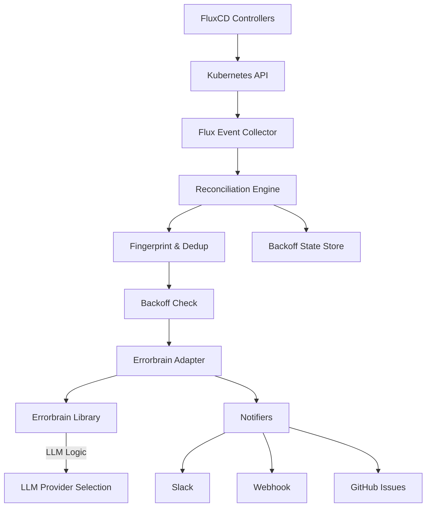

# Fluxbrain

**GitOps-native Fehlerdiagnose für FluxCD** – Orchestrierung auf Basis von [Errorbrain](https://github.com/afeldman/errorbrain).

---

## 🎯 Überblick

**Fluxbrain ist eine FluxCD-spezifische Orchestrierungsschicht auf Basis von Errorbrain.**

- **Errorbrain** führt die eigentliche Analyse und LLM-Interaktion durch
- **Fluxbrain** fokussiert sich auf:
  - Signal-Sammlung aus FluxCD (Kustomization, HelmRelease, GitRepository)
  - Kontext-Aufbereitung für Errorbrain
  - Multi-Channel-Benachrichtigung (Slack, Webhook, GitHub)
  - Deduplication & Backoff-Strategie

### Kernfunktionen

- ✅ **FluxCD-Integration**: Kustomization, HelmRelease, GitRepository
- ✅ **Event-basierte Fehlerkennung**: \`Ready=False\`, \`ReconciliationFailed\`, Kubernetes \`Warning\` Events
- ✅ **Errorbrain-Adapter**: Delegiert Analyse an Errorbrain (black box)
- ✅ **Retry-Safety Detection**: Errorbrain bewertet, ob Retry sinnvoll ist
- ✅ **Multi-Channel-Notifications**: Slack, Webhook, GitHub Issues
- ✅ **Deduplication & Backoff**: Fingerprinting verhindert Notification-Spam
- ✅ **Reconciliation Loop**: CronJob oder Continuous Deployment

---

## 🏗 Architektur



### Komponenten

#### 1. **Collector** (\`internal/collector\`)
- \`FluxEventCollector\`: Erfasst Kustomization-Fehler über Kubernetes Events
- **TODO**: Kubernetes-Client-Integration (aktuell Placeholder)

#### 2. **Context Builder** (\`internal/context\`)
- Normalisiert \`CollectedSignals\` → \`ErrorContext\` (LLM-optimiert)
- Deterministisches JSON ohne HTML-Escaping

#### 3. **Analysis** (\`internal/analysis\`)
- \`ErrorbrainAdapter\`: **Reiner Adapter** – keine eigene LLM-Logik
- Konvertiert \`ErrorContext\` → \`errorbrain.Input\` (JSON)
- Konvertiert \`errorbrain.Result\` → \`AnalysisResult\`
- **Errorbrain entscheidet**: Welches LLM, welcher Prompt, welche Provider

#### 4. **Notification** (\`internal/notify\`)
- \`SlackNotifier\`, \`WebhookNotifier\`, \`GitHubNotifier\`
- Strukturierte Meldungen mit Root Cause, Remediation, Retry-Safe

#### 5. **Reconciliation Engine** (\`internal/reconcile\`)
- **Engine**: Orchestriert Collection → Deduplizierung → Backoff → Analysis → Notification
- **Runner**: Ticker-basierter Scheduler für Continuous Mode
- **Backoff State**: In-Memory Store mit exponentieller Backoff-Strategie

#### 6. **State Management** (\`internal/state\`)
- **Fingerprinting**: SHA256-Hash über \`(Cluster, Resource, Reason, GitRevision)\`
- **MemoryStore**: Thread-safe Backoff-Tracking mit konfigurierbarem Max-Backoff

---

## 📦 Dependencies

Fluxbrain importiert **Errorbrain als Go-Modul**:

```go
// go.mod
module github.com/afeldman/fluxbrain

require (
    github.com/afeldman/errorbrain v0.0.0
)

// Lokale Entwicklung
replace github.com/afeldman/errorbrain => ../errorbrain
```

### Errorbrain Repository
- **Location**: https://github.com/afeldman/errorbrain
- **Responsibility**: LLM-Auswahl, Prompt-Engineering, Analyse-Logik
- **Interface** (erwartet):
  ```go
  type Analyzer interface {
      Analyze(input Input) (Result, error)
  }
  ```

---

## 🚀 Deployment

### CronJob (Empfohlen für Start)

```yaml
apiVersion: batch/v1
kind: CronJob
metadata:
  name: fluxbrain
  namespace: flux-system
spec:
  schedule: "*/5 * * * *"
  jobTemplate:
    spec:
      template:
        spec:
          containers:
          - name: fluxbrain
            image: ghcr.io/afeldman/fluxbrain:latest
            env:
            - name: FLUXBRAIN_RUN_MODE
              value: "once"
            - name: FLUXBRAIN_CLUSTER
              value: "prod-eu-west-1"
            - name: FLUXBRAIN_SLACK_WEBHOOK
              valueFrom:
                secretKeyRef:
                  name: fluxbrain-secrets
                  key: slack-webhook
          restartPolicy: OnFailure
```

### Deployment (Continuous Mode)

```yaml
apiVersion: apps/v1
kind: Deployment
metadata:
  name: fluxbrain
  namespace: flux-system
spec:
  replicas: 1
  selector:
    matchLabels:
      app: fluxbrain
  template:
    metadata:
      labels:
        app: fluxbrain
    spec:
      containers:
      - name: fluxbrain
        image: ghcr.io/afeldman/fluxbrain:latest
        env:
        - name: FLUXBRAIN_REQUEUE_INTERVAL
          value: "5m"
        - name: FLUXBRAIN_CLUSTER
          value: "prod-eu-west-1"
        - name: FLUXBRAIN_SLACK_WEBHOOK
          valueFrom:
            secretKeyRef:
              name: fluxbrain-secrets
              key: slack-webhook
```

---

## ⚙️ Konfiguration

### Pflicht-Variablen

| Variable | Beschreibung |
|----------|--------------|
| \`FLUXBRAIN_CLUSTER\` | Cluster-Name für Kontext |

**Hinweis**: Errorbrain-Integration erfolgt über Go-Modul, keine Runtime-Config erforderlich.

### Optional

| Variable | Default | Beschreibung |
|----------|---------|--------------|
| \`FLUXBRAIN_RUN_MODE\` | \`continuous\` | \`once\` für CronJob, sonst Continuous |
| \`FLUXBRAIN_REQUEUE_INTERVAL\` | \`5m\` | Ticker-Intervall (Continuous Mode) |
| \`FLUXBRAIN_FLUX_NAMESPACE\` | \`flux-system\` | FluxCD-Namespace |
| \`FLUXBRAIN_SLACK_WEBHOOK\` | - | Slack-Webhook-URL |
| \`FLUXBRAIN_WEBHOOK_URL\` | - | Generic Webhook |
| \`FLUXBRAIN_GITHUB_OWNER\` | - | GitHub-Owner für Issues |
| \`FLUXBRAIN_GITHUB_REPO\` | - | GitHub-Repo |
| \`FLUXBRAIN_GITHUB_TOKEN\` | - | GitHub-Token |

---

## 🔌 Errorbrain Integration

**Fluxbrain ruft KEINE LLMs direkt auf.** Alle Analyse-Logik liegt in Errorbrain.

### Aktueller Status

**MockAnalyzer** ist aktuell implementiert als Platzhalter:
- Gibt statische Analyse-Ergebnisse zurück
- Wird ersetzt sobald Errorbrain-Library verfügbar ist
- Siehe `cmd/fluxbrain/main.go` für Implementation

### Verantwortlichkeiten

| Fluxbrain | Errorbrain |
|-----------|------------|
| FluxCD-Event-Sammlung | LLM-Auswahl (OpenAI/Anthropic/...) |
| Kontext-Aufbereitung | Prompt-Engineering |
| Notification-Delivery | Root-Cause-Analyse |
| Deduplication & Backoff | Retry-Safety-Bewertung |
| Orchestrierung | Reasoning & Confidence-Scoring |

---

## 🧪 Testing

### Integration Test (Mock Errorbrain)

```bash
go test ./internal/analysis -v
```

Der Test verifiziert:
- \`ErrorContext\` → \`errorbrain.Input\` Serialisierung
- \`errorbrain.Result\` → \`AnalysisResult\` Konvertierung
- Kritische Felder bleiben erhalten (Cluster, Reason, Git-Kontext)

---

## 🔁 Reconciliation Flow

```
1. Timer/Cron Trigger
2. Collector.CollectErrors()
   └─ []ErrorContext
3. For each ErrorContext:
   ├─ Fingerprint(ec) → SHA256
   ├─ if InBackoff(fingerprint) → skip
   ├─ Analyzer.Analyze(ec) → AnalysisResult (via Errorbrain)
   ├─ Notifier.Notify(ec, result)
   └─ State.RegisterSuccess(fingerprint)
4. On error:
   └─ State.RegisterFailure(fingerprint)
      └─ Backoff = Failures * 30s (max 1h)
```

### Backoff-Strategie

- **Fingerprint**: `sha256(cluster + resource + reason + gitRevision)`
- **1. Fehler**: Backoff = 30s
- **2. Fehler**: Backoff = 60s
- **3. Fehler**: Backoff = 90s
- **Max**: 1h (konfigurierbar)
- **Reset**: Bei `RegisterSuccess()`

---

## 📦 Build

```bash
# Lokal
go build -o fluxbrain ./cmd/fluxbrain

# Docker
docker build -t fluxbrain:latest .
```

---

## 🔧 Entwicklung

### Projektstruktur

```
fluxbrain/
├── cmd/fluxbrain/          # Entrypoint
├── internal/
│   ├── collector/          # Flux Events, K8s API
│   ├── context/            # ErrorContext Builder
│   ├── analysis/           # Errorbrain Adapter (KEIN LLM-Code!)
│   ├── notify/             # Slack, GitHub, Webhook
│   ├── reconcile/          # Engine + Runner
│   ├── state/              # Fingerprinting + Backoff
│   └── config/             # Config Loader
├── pkg/types/              # Domain Types
└── README.md
```

### Lokale Entwicklung mit Errorbrain

```bash
# 1. Clone Errorbrain im Schwester-Verzeichnis
cd /Users/anton.feldmann/Projects/lynqtech
git clone https://github.com/afeldman/errorbrain.git

# 2. go.mod nutzt replace-Direktive
cd fluxbrain
cat go.mod
# replace github.com/afeldman/errorbrain => ../errorbrain

# 3. Build & Test
go build ./cmd/fluxbrain
go test ./...
```

### Nächste Schritte

1. **Kubernetes-Client-Integration**: \`EventLister\` mit \`client-go\` implementieren
2. **HelmRelease/GitRepository**: Weitere Collector-Typen
3. **Controller-Logs**: Optionale Log-Sammlung für tieferen Kontext
4. **Persistent State**: Redis/etcd statt In-Memory (Multi-Replica)
5. **Metrics**: Prometheus-Exporter für Monitoring

---

## 📝 Design Principles

### ❌ Anti-Patterns (vermeiden!)

- **LLM-Calls in Fluxbrain**: Alle Analyse-Logik gehört zu Errorbrain
- **Prompt-Engineering in Fluxbrain**: Errorbrain entscheidet über Prompts
- **Vendor-Lock-In**: Errorbrain abstrahiert LLM-Provider-Auswahl
- **Doppelte Logik**: Retry-Safety, Root-Cause → Errorbrain

### ✅ Best Practices

- **Separation of Concerns**: Fluxbrain = Orchestrierung, Errorbrain = Denken
- **Black Box Analyzer**: Errorbrain-Interface nicht implementieren, sondern aufrufen
- **Adapter Pattern**: `ErrorbrainAdapter` konvertiert nur Datentypen
- **Clean Boundaries**: Keine Errorbrain-Internals in Fluxbrain importieren

---

## 🧪 Testing

```bash
# Unit-Tests
go test ./...

# Spezifische Tests  
go test ./internal/state/...
go test ./internal/context/...

# Mit Coverage
go test -cover ./...
```

---

## 🙏 Credits

- **Errorbrain**: https://github.com/afeldman/errorbrain – Structured analysis core
- **FluxCD**: GitOps Toolkit für Kubernetes
